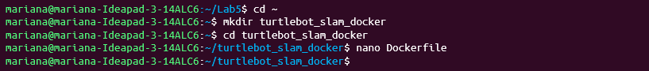

# Laboratorio de Simulación Robótica con Docker, ROS, PyBullet, LIDAR y SLAM
## Descripción General

Este repositorio contiene el desarrollo completo del laboratorio dividido en tres puntos principales:

Investigación y análisis de herramientas robóticas (ROS, MoveIt, Gazebo y tecnologías IoT).

Simulación de un cuadrúpedo (UR5) con PyBullet, desplegado mediante Docker.

Simulación de un robot móvil TurtleBot3 con LIDAR y SLAM (gmapping) en Docker, visualizando el mapa en tiempo real con Rviz y Gazebo.

## 1️⃣ Punto 1 — Investigación de Herramientas
---
### Investigación de Herramientas de Robótica

Se realizó una investigación detallada sobre las siguientes herramientas:

- **ROS (Robot Operating System):** Sistema operativo para robots que permite la comunicación entre nodos y la integración de sensores y actuadores.  
- **MoveIt:** Framework para planificación de movimiento de manipuladores robóticos.  
- **Gazebo:** Simulador 3D de entornos robóticos integrado con ROS.  
- **IoT:** Contextualización del Internet de las Cosas y su relación con la robótica.

Cada herramienta incluye:
- Definición y objetivos.  
- Alcance en el sector IoT.  
- Posibles aplicaciones prácticas.  
- Referencias bibliográficas.

---

### Investigación sobre Tecnologías LIDAR y SLAM

Se analizó la **robótica actual** enfocándose en los sistemas de percepción y localización:

- **LIDAR:** Principios de funcionamiento, tipos y aplicaciones.  
- **SLAM (Simultaneous Localization and Mapping):** Tipos de algoritmos, funcionamiento y su relación con LIDAR.  
- **Integración con IoT:** Cómo estas tecnologías permiten la comunicación y análisis remoto de datos robóticos.

---

### Exploración con Docker y Ejemplos Prácticos

Se propone una **exploración del potencial de Docker** para contener y desplegar entornos robóticos reproducibles.

Dos ejemplos fueron desarrollados:

####  Ejemplo 1: Robot con ROS, MoveIt y Gazebo
Simulación de un robot básico que realiza movimientos planificados, empleando:
- ROS para la comunicación de nodos.
- MoveIt para la planificación del movimiento.
- Gazebo para la simulación del entorno.

####  Ejemplo 2: Robot con LIDAR y SLAM
Implementación de un robot que utiliza sensores LIDAR y técnicas de SLAM para generar un mapa del entorno y localizarse en él.

Cada ejemplo incluye:
- Archivos Docker y configuración (`Dockerfile`, `docker-compose.yml`).  
- Código fuente y paquetes ROS.  
- Guía paso a paso de ejecución.

---

### Documento Académico (Overleaf)

El desarrollo teórico se encuentra en un documento en **Overleaf**, el cual incluye:

- Introducción y objetivos.  
- Marco teórico y conceptual.  
- Metodología de desarrollo.  
- Resultados y conclusiones.  
- Referencias en formato **APA 7**.

---

### Requisitos del Entorno

Para ejecutar los ejemplos prácticos se recomienda tener instaladas las siguientes herramientas:

- [Docker](https://www.docker.com/)  
- [ROS (Noetic o ROS 2 Foxy)](http://wiki.ros.org/)  
- [Gazebo](https://gazebosim.org/home)  
- [MoveIt](https://moveit.ros.org/)  
- Python 3.8 o superior  

---

### Instrucciones de Uso

1. Clonar el repositorio:
   ```
   git clone https://github.com/usuario/nombre-del-repositorio.git
   cd nombre-del-repositorio
   
2. Ejecutar el primer ejemplo (ROS + MoveIt + Gazebo):

 ```
Copiar código
docker-compose up ros-moveit-gazebo
```
3. Ejecutar el segundo ejemplo (LIDAR + SLAM):

 ```
Copiar código
docker-compose up lidar-slam
```

## Punto 2 — Simulación de un Cuadrúpedo (UR5) con PyBullet
### Objetivo

Controlar y visualizar un cuadrúpedo UR5 usando PyBullet, desplegándolo dentro de un contenedor Docker.

### Pasos
#### Crear el Dockerfile

  

#### Construir y ejecutar la imagen

  

### Resultados

  

El despliegue se ejecuta desde Docker (docker run --rm).

Se validó el control básico de movimiento.

## Punto 3 — Simulación TurtleBot3 con LIDAR y SLAM (Gmapping)
### Objetivo

Implementar un robot TurtleBot3 con sensor LIDAR, usando ROS Noetic y SLAM (gmapping) para crear un mapa en tiempo real dentro de Docker.

### Pasos
#### Crear el Dockerfile

  

#### Construir y ejecutar la imagen

  

### Resultados

  
